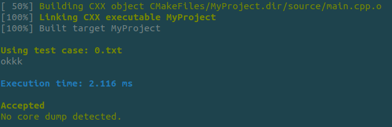
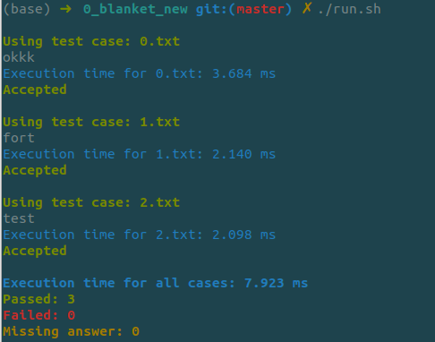

# Demo Test Template

这是一个本地代码模板仓库，主要用于快速编写、编译、运行和归档测试代码。

目前仓库同时保留了 `C++` 和 `Python` 两套入口，其中主要工作流围绕 `C++` 模板展开。

## 目录结构

```text
.
├── answer/
│   ├── 0.txt
│   ├── 1.txt
│   ├── 2.txt
│   └── ...
├── cpp/
│   ├── CMakeLists.txt
│   ├── helper/
│   │   └── helper.hpp
│   └── source/
│       └── main.cpp
├── py/
│   └── script.py
├── testcase/
│   ├── 0.txt
│   ├── 1.txt
│   ├── 2.txt
│   └── ...
├── make.sh
├── run.sh
└── new.sh
```

## 环境依赖
- `make.sh` 依赖 `cmake`、`make`、`bc`、`diff`、`perl`，并在检测到 core dump 时调用 `gdb`
- `run.sh` 依赖 `bc`、`diff`、`perl`
- `new.sh` 依赖 `zip`

## 主要文件说明

- `cpp/source/main.cpp`
  C++ 主程序入口，平时做题时主要修改这个文件。
- `cpp/helper/helper.hpp`
  放通用头文件、辅助函数、打印工具等。
- `cpp/CMakeLists.txt`
  C++ 编译配置，当前生成的可执行文件名为 `MyProject`。
- `py/script.py`
  Python 模板入口，当前为空。
- `testcase/*.txt`
  本地测试输入文件。
- `answer/*.txt`
  对应测试输入的标准输出文件，文件名需要和 `testcase` 中的样例同名。

## 使用方法

### 1. 编译并运行单个样例

默认会编译 `cpp/source/main.cpp`，然后用 `testcase/0.txt` 作为输入运行。

```bash
bash make.sh
```
示例输出：



如果需要使用 `Debug` 模式编译：

```bash
bash make.sh Debug
```

说明：

- 默认构建目录是 `cpp/build/`
- 可执行文件路径是 `cpp/build/MyProject`
- 如果存在 `testcase/0.txt`，脚本会自动喂入该文件
- 如果同时存在 `answer/0.txt`，脚本会自动比较程序输出和标准答案
- 判题使用同名文件比对，例如 `testcase/0.txt` 对应 `answer/0.txt`
- 如果没有 `testcase/0.txt`，脚本会进入手动输入模式
- 如果程序崩溃生成 core dump，脚本会尝试用 `gdb` 输出调用栈

### 2. 运行全部测试用例并自动判题

先确保已经成功编译，再运行：

```bash
bash run.sh
```
实例输出：


该脚本会：

- 遍历 `testcase/` 下所有 `.txt` 文件
- 用同名的 `answer/*.txt` 做自动比对
- 输出每个样例的运行耗时
- 输出判题结果：`Accepted`、`Wrong Answer`、`Runtime Error`
- 在最后汇总 `Passed`、`Failed`、`Missing answer`

示例映射关系：

- `testcase/0.txt` -> `answer/0.txt`
- `testcase/1.txt` -> `answer/1.txt`
- `testcase/2.txt` -> `answer/2.txt`

### 3. 备份并重置工作区

```bash
bash new.sh
```

这个脚本会先将以下目录打包到 `archive/`：

- `cpp/`
- `py/`
- `testcase/`

随后脚本会询问是否继续重置。

注意：

- 如果你输入的不是 `n` 或 `N`，脚本会继续执行“重置”
- 重置会清空 `testcase/`、`cpp/source/`、`py/`
- 然后重新生成一个最小的 `main.cpp` 模板和空的 `py/script.py`
- 如果你也依赖自动判题，建议后续把 `answer/` 也纳入备份与重置策略

这个操作具有破坏性，执行前请确认归档文件已经生成成功。

## 推荐工作流

0. 先运行 `bash new.sh` 备份并重置工作区
1. 在 `cpp/source/main.cpp` 中编写代码
2. 将样例输入保存到 `testcase/0.txt` 或更多 `.txt` 文件中
3. 将对应标准输出保存到同名的 `answer/*.txt` 中
4. 运行 `bash make.sh` 做单例调试和快速判题
5. 运行 `bash run.sh` 批量验证所有测试用例
